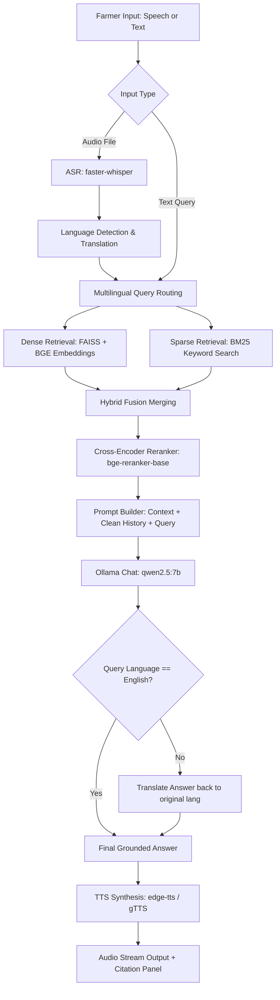

# Plant Doctor Chatbot 🍃

A voice-enabled, production-grade **Retrieval-Augmented Generation (RAG)** system designed to assist farmers with crop diagnoses, pest identification, fertilizer schedules, and general agricultural guidelines. 

The chatbot processes multilingual voice or text inputs (supporting **English, Hindi, Telugu, and Tamil**), performs a hybrid dense-sparse semantic document search, reranks candidate documents using a Cross-Encoder, and runs a localized LLM (`qwen2.5:7b` via Ollama) to output strictly grounded, context-aware answers accompanied by citations and voice responses.

---

## 🏗️ System Architecture

The following diagram illustrates the complete processing lifecycle of a farmer's query from audio input to speech output:



---

## 🛠️ Tech Stack & Key Components

### 🖥️ Frontend & Dashboard
*   **Streamlit**: Powers the interactive web application interface. Features real-time voice recorder widgets, custom HSL color-palette styles, interactive sidebar controls (language selector, document upload interface, index rebuild button), sliding citation panels, and diagnostic latency metrics.
*   **Streamlit Mic Recorder**: Custom browser component enabling raw client-side voice recording.

### ⚙️ Backend API Server
*   **FastAPI & Uvicorn**: High-performance HTTP server rendering endpoints for chat generation (`POST /chat`), voice transcription (`POST /voice`), document ingestion (`POST /upload`), FAISS index builds (`POST /embed`), history management (`/history`), and system status health queries (`GET /health`).

### 🔍 Retrieval & RAG Pipeline
*   **Hybrid Search Engine**: Integrates a two-part search workflow:
    1.  **Dense Retrieval**: Uses **FAISS** (Facebook AI Similarity Search) paired with **`BAAI/bge-small-en-v1.5`** embeddings.
    2.  **Sparse Retrieval**: Implements a custom **BM25 (Sparse Keyword)** scoring matrix to locate precise agricultural terms.
*   **Cross-Encoder Reranking**: Leverages **`BAAI/bge-reranker-base`** to re-evaluate the top 15 candidate document chunks, sorting the most contextually relevant resources to present to the LLM.
*   **Metadata DB**: A dedicated local **SQLite database** (`data/metadata/metadata.db`) tracking document names, chunk IDs, source page mappings, and languages.

### 🧠 Large Language Model (LLM)
*   **Ollama**: Local inference server orchestrating the **`qwen2.5:7b`** model. Configured with a `temperature` of `0.2` and customized chat templates to force instruction-following and eliminate output hallucinations.

### 🎙️ Speech & Multilingual Processing
*   **Speech-to-Text (STT)**: Powered by **`faster-whisper-base`** executing on the CPU (using `int8` quantization for optimal execution speeds).
*   **Text-to-Speech (TTS)**: Built using **`edge-tts`** (Microsoft Neural neural voices) for smooth natural vocal generation in multiple Indian accents, falling back to **`gTTS`** (Google TTS) if network issues arise.
*   **Translation Engine**: Uses **`deep-translator`** (Google Translator wrapper) to implement adaptive query routing and translate native queries into English when target document matches do not exist natively.

### ⚡ Performance & Cache Optimization
*   **Embedding Cache**: Persistent caching of document embedding calculations.
*   **Translation Cache**: Caches localized translations of queries and responses to avoid external API roundtrips.
*   **LLM Generation Cache**: Employs query-to-answer hashing (with history invalidation) to yield instant responses for repeated queries.

---

## 🚀 Installation & Local Setup

### Prerequisites
1.  **Python**: Version `3.10` to `3.12` installed.
2.  **Ollama**: Install locally on your system, boot the server, and download the target model:
    ```bash
    ollama serve
    # In another terminal window:
    ollama pull qwen2.5:7b
    ```

### Quick Start with Make
A `Makefile` is included to orchestrate virtual environment management and execution tasks.

1.  **Initialize Environment & Virtual Environment**:
    Creates a `.venv` folder, installs required library dependencies, creates folder structures, and installs a set of default dummy documents in `data/documents/`:
    ```bash
    make setup
    ```
2.  **Launch Backend API Server**:
    Starts the FastAPI server locally at `http://127.0.0.1:8000`:
    ```bash
    make run-backend
    ```
3.  **Launch Streamlit Frontend**:
    Starts the user interface at `http://localhost:8501`:
    ```bash
    make run-frontend
    ```

---

## 🛰️ API Endpoint Reference

| Endpoint | Method | Description |
| :--- | :--- | :--- |
| `/chat` | `POST` | Receives JSON text queries (query, session_id, language). Returns answers and citations. |
| `/voice` | `POST` | Accepts multipart form upload of raw WAV voice recordings. Transcribes, queries RAG, synthesizes TTS, and returns audio stream URLs. |
| `/upload` | `POST` | Accepts a multipart document upload (PDF, DOCX, TXT, MD), immediately chunks, and pushes to vector index. |
| `/embed` | `POST` | Forces a complete rebuild of the vector database from documents inside `data/documents/`. |
| `/history` | `GET` | Retrieves conversational history memory window for a specific `session_id`. |
| `/history` | `DELETE`| Clears conversational history memory window for a specific `session_id`. |
| `/health` | `GET` | Queries state readiness of vector index, metadata store, and local Ollama server connectivity. |

---

## 🧪 Verification & Benchmarks

The project is accompanied by robust testing, evaluation, and latency benchmarking pipelines.

*   **Unit Tests**: Run code assertions covering tokenizers, index builders, prompt templates, and endpoint integrations:
    ```bash
    make test
    ```
*   **RAG Metrics Evaluation**: Compares generated responses against test validation datasets to measure Faithfulness, Precision, Recall, and Relevancy:
    ```bash
    make eval
    ```
*   **Latency Benchmarking**: Traces and breaks down computational bottlenecks across retrieval steps, rerank logic, STT transcription, and LLM completions:
    ```bash
    make benchmark
    ```

---

## 📄 License

This repository is maintained for local crop diagnostics research. Licensed under the [MIT License](LICENSE).
