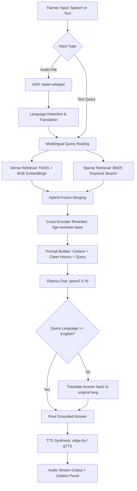

# Plant Doctor Chatbot 🍃

A voice-enabled, production-grade **Retrieval-Augmented Generation (RAG)** system designed to assist farmers with crop diagnoses, pest identification, fertilizer schedules, and general agricultural guidelines. 

The chatbot processes multilingual voice or text inputs (supporting **English, Hindi, Telugu, and Tamil**), performs a hybrid dense-sparse semantic document search, reranks candidate documents using a Cross-Encoder, and runs a localized LLM (`qwen2.5:7b` via Ollama) to output strictly grounded, context-aware answers accompanied by citations and voice responses.

---

## 🏗️ System Architecture

The following diagram illustrates the complete processing lifecycle of a farmer's query from audio input to speech output:


```mermaid
graph TD
    A[Farmer Input: Speech or Text] --> B{Input Type}
    
    %% Voice Path
    B -->|Audio File| C[ASR: faster-whisper]
    C --> D[Language Detection & Translation]
    D --> E[Multilingual Query Routing]
    
    %% Text Path
    B -->|Text Query| E
    
    %% Ingestion / RAG Pipeline
    E --> F[Dense Retrieval: FAISS + BGE Embeddings]
    E --> G[Sparse Retrieval: BM25 Keyword Search]
    F --> H[Hybrid Fusion Merging]
    G --> H
    
    H --> I[Cross-Encoder Reranker: bge-reranker-base]
    I --> J[Prompt Builder: Context + Clean History + Query]
    J --> K[Ollama Chat: qwen2.5:7b]
    
    %% Response translation & Speech Path
    K --> L{Query Language == English?}
    L -->|No| M[Translate Answer back to original lang]
    L -->|Yes| N[Final Grounded Answer]
    M --> N
    N --> O[TTS Synthesis: edge-tts / gTTS]
    O --> P[Audio Stream Output + Citation Panel]
```

---

## 🛠️ Tech Stack & Key Components

### 🖥️ Frontend & Dashboard
*   **Streamlit**: Powers the interactive web application interface. Features real-time voice recorder widgets, custom HSL color-palette styles, interactive sidebar controls (language selector, document upload interface, index rebuild button), sliding citation panels, and diagnostic latency metrics.
*   **Streamlit Mic Recorder**: Custom browser component enabling raw client-side voice recording.

### ⚙️ Backend API Server
*   **FastAPI & Uvicorn**: High-performance HTTP server rendering endpoints for chat generation (`POST /chat`), voice transcription (`POST /voice`), document ingestion (`POST /upload`), FAISS index builds (`POST /embed`), history management (`/history`), and system status health queries (`GET /health`).

### 🔍 Retrieval & RAG Pipeline
*   **Hybrid Search Engine**: Integrates a two-part search workflow:
    1.  **Dense Retrieval**: Uses **FAISS** (Facebook AI Similarity Search) paired with **`BAAI/bge-small-en-v1.5`** embeddings.
    2.  **Sparse Retrieval**: Implements a custom **BM25 (Sparse Keyword)** scoring matrix to locate precise agricultural terms.
*   **Cross-Encoder Reranking**: Leverages **`BAAI/bge-reranker-base`** to re-evaluate the top 15 candidate document chunks, sorting the most contextually relevant resources to present to the LLM.
*   **Metadata DB**: A dedicated local **SQLite database** (`data/metadata/metadata.db`) tracking document names, chunk IDs, source page mappings, and languages.

### 🧠 Large Language Model (LLM) Client Abstraction
*   **LLM Factory Pattern**: Refactored to support multiple LLM providers behind a common interface (`backend/llm/`). All RAG client invocations route through a unified abstraction, switching dynamically based on `LLM_PROVIDER` in your `.env` configuration.
*   **Ollama (Local Development)**: Orchestrates local offline inference with the **`qwen2.5:7b`** model (or any customized model name) at a `temperature` of `0.2` for zero-cost RAG runs.
*   **Groq API (Production Deployment)**: Integrated the high-speed **Groq Cloud completions API** (targeting **`llama-3.3-70b-versatile`**) for fast responses in cloud production instances without needing heavy local server resource requirements.

### 🎙️ Speech & Multilingual Processing
*   **Speech-to-Text (STT)**: Powered by **`faster-whisper-base`** executing on the CPU (using `int8` quantization for optimal execution speeds).
*   **Text-to-Speech (TTS)**: Built using **`edge-tts`** (Microsoft Neural neural voices) for smooth natural vocal generation in multiple Indian accents, falling back to **`gTTS`** (Google TTS) if network issues arise.
*   **Translation Engine**: Uses **`deep-translator`** (Google Translator wrapper) to implement adaptive query routing and translate native queries into English when target document matches do not exist natively.

### ⚡ Performance & Cache Optimization
*   **Embedding Cache**: Persistent caching of document embedding calculations.
*   **Translation Cache**: Caches localized translations of queries and responses to avoid external API roundtrips.
*   **LLM Generation Cache**: Employs query-to-answer hashing (with history invalidation) to yield instant responses for repeated queries.

---

## ⚙️ Environment Configuration

The application determines its LLM execution mode automatically based on the environment variables defined in your `.env` file:

### 1. Local Development Mode (Ollama Offline)
Use this setup to run the LLM completely offline on your local computer using Ollama:
```ini
LLM_PROVIDER=ollama
OLLAMA_BASE_URL=http://localhost:11434
OLLAMA_MODEL=qwen2.5:7b
```

### 2. Cloud Deployment Mode (Groq API)
Use this setup to run the LLM in the cloud using Groq completions, bypassing Ollama completely:
```ini
LLM_PROVIDER=groq
GROQ_API_KEY=gsk_your_groq_api_key_here
GROQ_MODEL=llama-3.3-70b-versatile
```

---

## 🚀 Local Installation & Setup

### Prerequisites
1.  **Python**: Version `3.10` to `3.12` installed.
2.  **Ollama** (Only required for Local Development Mode): Install locally, run the service, and pull the model:
    ```bash
    ollama serve
    # In another terminal window:
    ollama pull qwen2.5:7b
    ```

### Quick Start with Make
A `Makefile` is included to orchestrate virtual environment management and execution tasks.

1.  **Initialize Environment**:
    Creates a `.venv` folder, installs required library dependencies, creates folder structures, and installs a set of default documents in `data/documents/`:
    ```bash
    make setup
    ```
2.  **Configure environment variables**:
    Create `.env` based on `.env.example` and set your preferred `LLM_PROVIDER` parameters.
3.  **Launch FastAPI Backend Server**:
    Starts the FastAPI server locally at `http://127.0.0.1:8000`:
    ```bash
    make run-backend
    ```
4.  **Launch Streamlit Frontend**:
    Starts the user interface at `http://localhost:8501`:
    ```bash
    make run-frontend
    ```

---

## ☁️ Cloud Deployment (Render Blueprint)

This project is configured to deploy directly to **[Render](https://render.com/)** using the included Blueprint file (`render.yaml`). This spins up separate Frontend (Streamlit) and Backend (FastAPI) web services.

### Steps to Deploy on Render:
1.  Push your codebase to your own GitHub repository.
2.  Log in to your **Render Dashboard** and select **Blueprints** -> **New Blueprint Instance**.
3.  Connect your GitHub repository. Render will automatically parse the `render.yaml` file.
4.  Configure the environment parameters during instantiation:
    *   Set `LLM_PROVIDER` to `groq`.
    *   Securely enter your `GROQ_API_KEY` (obtained from the Groq Console).
    *   (Optional) Customize models or ports if needed.
5.  Click **Approve / Deploy**. Render will spin up:
    *   `plant-doctor-backend`: A Python web service running FastAPI with a **10GB Persistent Disk** attached at `/opt/render/project/src/data` (ensuring your uploaded manuals, SQLite database, and FAISS index are preserved across restarts).
    *   `plant-doctor-frontend`: A Streamlit web service connected directly to the backend URL via Render's service communication network.

> [!IMPORTANT]
> Running the RAG pipeline models (Whisper STT, SentenceTransformers, Cross-Encoder) requires a reasonable amount of memory. Deploying the backend service on Render's **Starter Instance (2GB RAM)** is highly recommended to avoid Out-Of-Memory (OOM) build failures on the free tier.

---

## 🛰️ API Endpoint Reference

| Endpoint | Method | Description |
| :--- | :--- | :--- |
| `/chat` | `POST` | Receives JSON text queries (query, session_id, language). Returns answers and citations. |
| `/voice` | `POST` | Accepts multipart form upload of raw WAV voice recordings. Transcribes, queries RAG, synthesizes TTS, and returns audio stream URLs. |
| `/translate` | `POST` | Translates a given text and generates TTS synthesized audio for real-time translation toggles. |
| `/upload` | `POST` | Accepts a multipart document upload (PDF, DOCX, TXT, MD), immediately chunks, and pushes to vector index. |
| `/embed` | `POST` | Forces a complete rebuild of the vector database from documents inside `data/documents/` and clears response cache. |
| `/history` | `GET` | Retrieves conversational history memory window for a specific `session_id`. |
| `/history` | `DELETE`| Clears conversational history memory window for a specific `session_id`. |
| `/health` | `GET` | Queries state readiness of vector index, metadata store, and local Ollama server connectivity. |

---

## 🧪 Verification & Benchmarks

The project is accompanied by robust testing, evaluation, and latency benchmarking pipelines.

*   **Unit Tests**: Run code assertions covering tokenizers, index builders, prompt templates, and endpoint integrations:
    ```bash
    make test
    ```
*   **RAG Metrics Evaluation**: Compares generated responses against test validation datasets to measure Faithfulness, Precision, Recall, and Relevancy:
    ```bash
    make eval
    ```
*   **Latency Benchmarking**: Traces and breaks down computational bottlenecks across retrieval steps, rerank logic, STT transcription, and LLM completions:
    ```bash
    make benchmark
    ```

---

## 📄 License

This repository is maintained for local crop diagnostics research. Licensed under the [MIT License](LICENSE).
